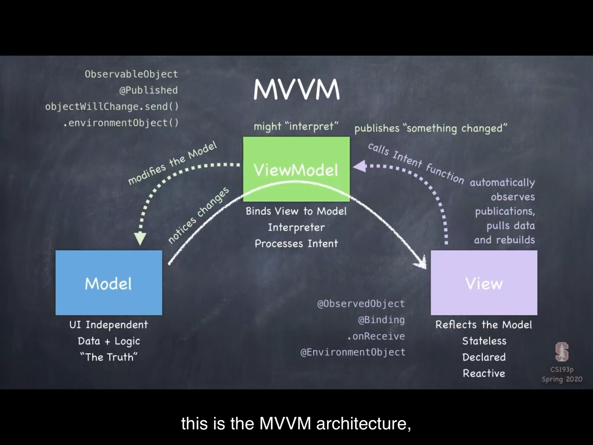
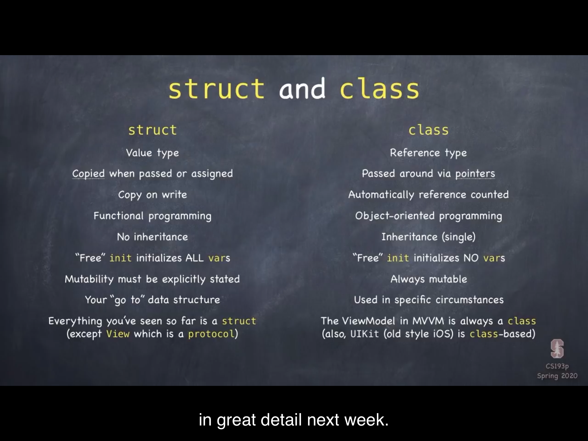

使用Apple最新的Swift UI技术编写更好的app。

随着技术的不断进步，iOS的开发语言也在不断的进步。不仅开发语言再进步，界面的开发也是历经了很多技术更新，从一开始的完全使用代码----> 到后来的xib----> 再到后来的storyboard-----> 再到现在的Swift UI，虽然现在大部分开发者还在使用storyboard，但现在Swift UI越来越成为趋势。开发人员要不断学习新的技术，精进自己的技能，用新技术编写更好应用。对与已经从事iOS开发多年的开发人员来说，学习新的技能并不难，关键是你要愿意学。

本次所学课程为美国斯坦福大学最新的iOS编程课程。使用全新的swift UI进行编写。除了Apple官方的文档，sanford 大学的iOS编程课一直是非常不错的学习教材。

本人所用开发环境：

Xcode版本：12.0

macOS版本：11.0 macOS Big Sur

Github仓库地址:https://github.com/MyColourfulLife/MySwiftUI

github仓库中的图片，您可能需要科学上网才能看得到。

第一天：

写了一个卡片demo，目前的状态是写了四个卡片，卡片的正面是个幽灵图片，卡片反面纯色背景。后续可以翻开卡片，看到卡片正面。后面会增加更多不同内容的卡片，翻开两张卡片相同加分，不同扣分。

目前做的结果如图：


知识点：

SwiftUI编写和我们使用平常使用的开发技术多少会有些不同。

```swift
struct ContentView: View {
    var body: some View {
       Text("Hello World!")
    }
}
```

第一个很有意思的是：`ContentView: View`

在面向对象编程的语言中，我们通常会说“结构体ContentView 是 一种View ”，而在这里，并不是“是”的意思，这和我们所说的继承关系不一样。在这里是说，this struct is going to behave like a View or it's going to function like a View.也就是说我们声明的这个contentView这个结构体的行为(方法)和View相似。我们知道一个View是一个矩形，有边框，背景，前景，可以触摸，缩放，响应事件等等。我们声明的这个结构体表现和View相似。


第二个很有意思的是：`var body: some View`

body是一个计算属性，类型是 some View， 意思是某种view，但并没有说是哪种View，之所以不指明是哪种View，是为了开发方便，让程序去推断返回的应该是什么类型的View。

像上面的代码那样，返回的就是 Text 这种类型的View，我们其实也可以写

```swift
 var body: Text {
       Text("Hello World!")
 }
```

但是这样我们应对不了很多情况，程序需要的内容可能是文本，也可能是图片，还可能是一堆视图的集合。因此我们并不具体指明使用哪种类型的View，而是使用 some View 来指定body的类型。


上述代码 Text之前省略了 return，这是swift语言的特性，当只有一行语句时可以省略return。


文本用 Text， 圆角矩形用 RoundedRectangle，把文本叠加在圆角矩形上，我们可以使用 ZStack，意思是垂直于屏幕摆放。

```swift
        ZStack {
            RoundedRectangle(cornerRadius: 10).fill(Color.white)
            RoundedRectangle(cornerRadius: 10).stroke(lineWidth: 3)
            Text("👻")
        }
```

构造ZStack的时候，其实是用 `ZStack(content: {})`构造的，最后一个参数是closure时，可能省略行参，打括号直接写在后面 `ZStack(){}`,当没有参数时，圆括号也可以省略，就变成了上面的样子。这个在Swift中很常见，已经用Swift开发很多年了，就不多提了，后面会经常遇到。

```swift
            RoundedRectangle(cornerRadius: 10).fill(Color.white)
```

这句话的意思是为圆角半径为10的矩形填充上白色。填充用fill，描边用stroke。之所以要加上这句话是因为在iOS dark mode 下，背景会自动填充为黑色。这不是我们想要的，所以加上了这句话，使其不管在light mode 还是 dark mode 都看起来很舒服。

HStack 、VStack 和 ZStack 都是表现像View的 视图容器，可以组合视图，视图里面的部分属性会从上层View获取属性，当然也给可以给视图直接设置属性。

```swift
 ZStack {
               RoundedRectangle(cornerRadius: 10).fill(Color.white) // 重新设置颜色为白色
            RoundedRectangle(cornerRadius: 10).stroke(lineWidth: 3) 
            Text("👻")
        }.foregroundColor(.orange)
        .font(.largeTitle)
```

上述中 第二个矩形和下面的Text都会使用ZStack的前景色，当前emoji 文本本身具有形状颜色，在这里不会重新绘制颜色。若果换成普通的文字，效果就很明显。文本的字体使用 上层的 largeTitle。


foreach的使用。这里介绍了foreach的一种使用方式

```swift
ForEach(0..<4){ index in
               GridView()
}
```

这里用range而没有用数字，执行4次，生成了四个卡片。

---

第二天：使用MVVM重构代码


我们在使用swiftUI和swift时，大多数时候都是使用函数式编程。在传统的iOS开发中我们也通常使用MVC架构，然而在使用SwiftUI时我们更多使用的是MVVM架构而不是MVC架构。swiftUI是描述性语言，告诉程序界面应该这么显示，界面就实时的显示当前model的数据。


在MVVM中，model是不依赖于UI的，负责数据和逻辑。UI则是声明式的，无状态的，实时反映model数据的。

而model和view之间的桥梁则是ViewModel, 它负责将视图绑定到数据。当model发生变化时，model通知变化给ViewModel，ViewModel发布变化，View刷新页面。ViewModel从来不持有View，View获取到变化之后向ViewModel获取数据并重绘自己，而不是直接向Model获取数据。一方面ViewModel保护了Model，另一方面ViewModel可能还需要处理数据方便View展示。

View获取的用户交互事件如何反应到Model？

View的交互事件，比如点击按钮等用户的意图，也是由ViewModel进行处理，View调用意图处理函数，由ViewModel进行处理，ViewModel修改了Model之后，一旦Model发生变化，View就会实时更新页面，在SwiftUI的架构中，View总是显示当前的状态。



重构应用，我们的目的是使用MVVM架构。

创建model：MemoryGame

```swift
struct MemoryGame<CardContent> {
    var cards:Array<Card>
    
    init(numberOfCards:Int,cardContentFactory:(Int)->CardContent) {
        cards = Array<Card>()
        for pairIndex in 0 ..< numberOfCards {
            let content = cardContentFactory(pairIndex)
            cards.append(Card(content: content, id: 2*pairIndex))
            cards.append(Card(content: content, id: 2*pairIndex + 1))
        }
    }
    
    func choose(card:Card) {
        print("card choosen:\(card)")
    }
    struct Card:Identifiable {
        var isFaceUp:Bool = false
        var isMactched:Bool = false
        var content:CardContent
        var id: Int
    }
}
```

在这个model中，我们定义了需要显示的卡片数组，定义了卡片结构体，定义了选择卡片的处理逻辑。

在定义卡片时，我们的卡片内容可能是文本，也可能是图片，卡片内容可能是任何东西，因此卡片内容具体是什么类型我们不关心，我们不确定是什么类型，而在调用者具体使用时，需要指明是什么类型。而swift是一种强类型语言，如何表示这种不确定的类型呢，在swift中我们使用泛型来表示。`var content:CardContent`CardContent就是泛型，使用角括号来定义`<CardContent>`名字是自己取的，开发过程中要使用有意义的名字命名。

创建ViewModel

```swift
class EmojiMemoryGame {
   private var model:MemoryGame<String> = EmojiMemoryGame.createMemoryGame()
   static func createMemoryGame() -> MemoryGame<String> {
        let emojis = ["😘","🥰"]
        return MemoryGame<String>(numberOfCards: emojis.count) { index -> String in
            emojis[index]
        }
    }
    // MARK: - Access to the model
    var cards:Array<MemoryGame<String>.Card> {model.cards}
    
    // MARK: - Intent(s)
    func shoose(card:MemoryGame<String>.Card) {
        model.choose(card: card)
    }
}
```

创建ViewModel时，我们选择使用类而不是结构体。在swift中，结构体和类非常相似，主要区别如下图。




| struct                           | class                        |
| -------------------------------- | ---------------------------- |
| 值类型                           | Reference type               |
| Copied when passed or assigned   | Passed around via pointers   |
| Copy on write                    | ARC 自动引用计数             |
| 函数式编程                       | 面向对象编程                 |
| 没有继承                         | 继承(单继承)                 |
| 免费的初始化方法(包含所有的vars) | 免费的初始化方法(不包含vars) |
| 修改时必须特别说明               | 总是可变的                   |


ViewModel使用class的主要原因是方便共享数据。方便共享数据同时也带来了风险。我们知道，在swiftui 中，View总是反应Model，如果多个视图共享ViewModel的model数据，这个修改，那个修改，可能会把model搞乱。所以，共享也是有一定的风险。而我们如何应对这种风险呢。

在EmojiMemoryGame中，如果直接将model暴漏出去，则对所有的view都是可见的，所有的view都是可以访问和修改的。如果我们加上`private` 则他们就看不到了，既不能读也不能写。这不是我们想要的，如果让他们可以读取不能修改，我们可以在private后面加上set`private(set)`我们制定，仅EmojiMemoryGame可以修改。这样外界就看得见了，能读取但不能修改。保证了model的安全。但本程序我们没有直接这么做。我们直接使用private把model隐藏起来，而是单独提供了访问的接口`var cards:Array<MemoryGame<String>.Card> {model.cards}`

我们在创建model时，使用了静态函数。`static func createMemoryGame() -> MemoryGame<String>`这是因为在给model初始化时，如果使用的不是static，则函数就是实例函数，实例函数需要在实例实例化之后才能使用，因此在这个位置，如果不是静态函数，model初始化赋值就会报错。


处理view

```swift
struct ContentView: View {
    var viewModel:EmojiMemoryGame
    var body: some View {
        HStack {
            ForEach(viewModel.cards){ card in
               GridView(card: card)
            }
        }
        .padding()
        .foregroundColor(.orange)
        .font(.largeTitle)
        .frame(height:150)
    }
}

struct GridView: View {
    var card:MemoryGame<String>.Card
    var body: some View {
        ZStack {
            if card.isFaceUp {
            RoundedRectangle(cornerRadius: 10).fill(Color.white)
            RoundedRectangle(cornerRadius: 10).stroke(lineWidth: 3)
                Text(card.content)
            }else {
                RoundedRectangle(cornerRadius: 10).fill(Color.orange)
            }
        }
    }
}
```

在卡片视图GridView中，我们直接是使用卡片数据绘制视图。

在视图ContentView中，我们需要ViewModel来连接view和model。使用ForEach函数，内容需要遵守Identifiable协议，因此我们在Card定义中，遵循了Identifiable协议。程序可以更好的区分卡片，为后续卡片的移动和动画打下了基础。

