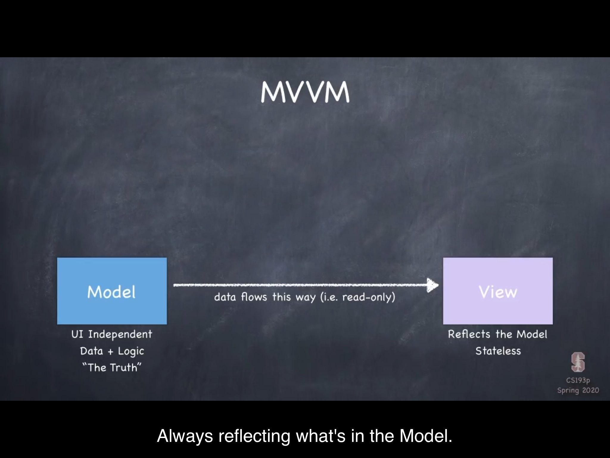
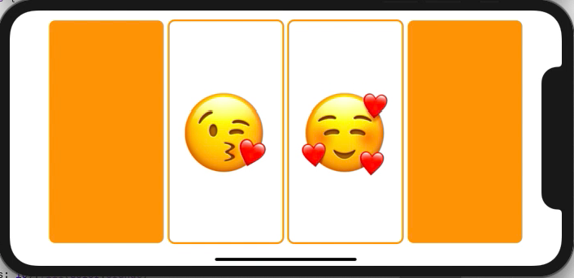
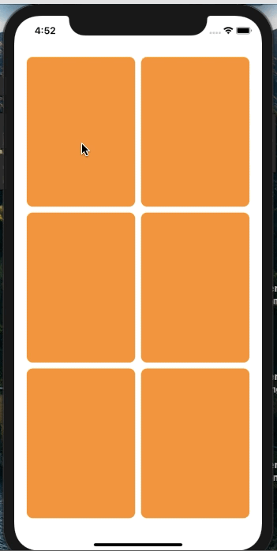

使用Apple最新的Swift UI技术编写更好的app。

随着技术的不断进步，iOS的开发语言也在不断的进步。不仅开发语言再进步，界面的开发也是历经了很多技术更新，从一开始的完全使用代码----> 到后来的xib----> 再到后来的storyboard-----> 再到现在的Swift UI，虽然现在大部分开发者还在使用storyboard，但现在Swift UI越来越成为趋势。开发人员要不断学习新的技术，精进自己的技能，用新技术编写更好应用。对与已经从事iOS开发多年的开发人员来说，学习新的技能并不难，关键是你要愿意学。

本次所学课程为美国斯坦福大学最新的iOS编程课程。使用全新的swift UI进行编写。除了Apple官方的文档，sanford 大学的iOS编程课一直是非常不错的学习教材。

本人所用开发环境：

Xcode版本：12.0

macOS版本：11.0 macOS Big Sur

Github仓库地址:https://github.com/MyColourfulLife/MySwiftUI

> **注意⚠️：github仓库中的图片，您可能需要科学上网才能看得到。**

第一天：

写了一个卡片demo，目前的状态是写了四个卡片，卡片的正面是个幽灵图片，卡片反面纯色背景。后续可以翻开卡片，看到卡片正面。后面会增加更多不同内容的卡片，翻开两张卡片相同加分，不同扣分。

目前做的结果如图：


知识点：

SwiftUI编写和我们使用平常使用的开发技术多少会有些不同。

```swift
struct ContentView: View {
    var body: some View {
       Text("Hello World!")
    }
}
```

第一个很有意思的是：`ContentView: View`

在面向对象编程的语言中，我们通常会说“结构体ContentView 是 一种View ”，而在这里，并不是“是”的意思，这和我们所说的继承关系不一样。在这里是说，this struct is going to behave like a View or it's going to function like a View.也就是说我们声明的这个contentView这个结构体的行为(方法)和View相似。我们知道一个View是一个矩形，有边框，背景，前景，可以触摸，缩放，响应事件等等。我们声明的这个结构体表现和View相似。


第二个很有意思的是：`var body: some View`

body是一个计算属性，类型是 some View， 意思是某种view，但并没有说是哪种View，之所以不指明是哪种View，是为了开发方便，让程序去推断返回的应该是什么类型的View。

像上面的代码那样，返回的就是 Text 这种类型的View，我们其实也可以写

```swift
 var body: Text {
       Text("Hello World!")
 }
```

但是这样我们应对不了很多情况，程序需要的内容可能是文本，也可能是图片，还可能是一堆视图的集合。因此我们并不具体指明使用哪种类型的View，而是使用 some View 来指定body的类型。


上述代码 Text之前省略了 return，这是swift语言的特性，当只有一行语句时可以省略return。


文本用 Text， 圆角矩形用 RoundedRectangle，把文本叠加在圆角矩形上，我们可以使用 ZStack，意思是垂直于屏幕摆放。

```swift
        ZStack {
            RoundedRectangle(cornerRadius: 10).fill(Color.white)
            RoundedRectangle(cornerRadius: 10).stroke(lineWidth: 3)
            Text("👻")
        }
```

构造ZStack的时候，其实是用 `ZStack(content: {})`构造的，最后一个参数是closure时，可能省略行参，打括号直接写在后面 `ZStack(){}`,当没有参数时，圆括号也可以省略，就变成了上面的样子。这个在Swift中很常见，已经用Swift开发很多年了，就不多提了，后面会经常遇到。

```swift
            RoundedRectangle(cornerRadius: 10).fill(Color.white)
```

这句话的意思是为圆角半径为10的矩形填充上白色。填充用fill，描边用stroke。之所以要加上这句话是因为在iOS dark mode 下，背景会自动填充为黑色。这不是我们想要的，所以加上了这句话，使其不管在light mode 还是 dark mode 都看起来很舒服。

HStack 、VStack 和 ZStack 都是表现像View的 视图容器，可以组合视图，视图里面的部分属性会从上层View获取属性，当然也给可以给视图直接设置属性。

```swift
 ZStack {
               RoundedRectangle(cornerRadius: 10).fill(Color.white) // 重新设置颜色为白色
            RoundedRectangle(cornerRadius: 10).stroke(lineWidth: 3) 
            Text("👻")
        }.foregroundColor(.orange)
        .font(.largeTitle)
```

上述中 第二个矩形和下面的Text都会使用ZStack的前景色，当前emoji 文本本身具有形状颜色，在这里不会重新绘制颜色。若果换成普通的文字，效果就很明显。文本的字体使用 上层的 largeTitle。


foreach的使用。这里介绍了foreach的一种使用方式

```swift
ForEach(0..<4){ index in
               GridView()
}
```

这里用range而没有用数字，执行4次，生成了四个卡片。

---

第二天：使用MVVM重构代码


我们在使用swiftUI和swift时，大多数时候都是使用函数式编程。在传统的iOS开发中我们也通常使用MVC架构，然而在使用SwiftUI时我们更多使用的是MVVM架构而不是MVC架构。swiftUI是描述性语言，告诉程序界面应该这么显示，界面就实时的显示当前model的数据。




在MVVM中，model是不依赖于UI的，负责数据和逻辑。UI则是声明式的，无状态的，实时反映model数据的。

而model和view之间的桥梁则是ViewModel, 它负责将视图绑定到数据。当model发生变化时，model通知变化给ViewModel，ViewModel发布变化，View刷新页面。ViewModel从来不持有View，View获取到变化之后向ViewModel获取数据并重绘自己，而不是直接向Model获取数据。一方面ViewModel保护了Model，另一方面ViewModel可能还需要处理数据方便View展示。

View获取的用户交互事件如何反应到Model？

View的交互事件，比如点击按钮等用户的意图，也是由ViewModel进行处理，View调用意图处理函数，由ViewModel进行处理，ViewModel修改了Model之后，一旦Model发生变化，View就会实时更新页面，在SwiftUI的架构中，View总是显示当前的状态。


重构应用，我们的目的是使用MVVM架构。

创建model：MemoryGame

```swift
struct MemoryGame<CardContent> {
    var cards:Array<Card>
    
    init(numberOfCards:Int,cardContentFactory:(Int)->CardContent) {
        cards = Array<Card>()
        for pairIndex in 0 ..< numberOfCards {
            let content = cardContentFactory(pairIndex)
            cards.append(Card(content: content, id: 2*pairIndex))
            cards.append(Card(content: content, id: 2*pairIndex + 1))
        }
    }
    
    func choose(card:Card) {
        print("card choosen:\(card)")
    }
    struct Card:Identifiable {
        var isFaceUp:Bool = false
        var isMactched:Bool = false
        var content:CardContent
        var id: Int
    }
}
```

在这个model中，我们定义了需要显示的卡片数组，定义了卡片结构体，定义了选择卡片的处理逻辑。

在定义卡片时，我们的卡片内容可能是文本，也可能是图片，卡片内容可能是任何东西，因此卡片内容具体是什么类型我们不关心，我们不确定是什么类型，而在调用者具体使用时，需要指明是什么类型。而swift是一种强类型语言，如何表示这种不确定的类型呢，在swift中我们使用泛型来表示。`var content:CardContent`CardContent就是泛型，使用角括号来定义`<CardContent>`名字是自己取的，开发过程中要使用有意义的名字命名。

创建ViewModel

```swift
class EmojiMemoryGame {
   private var model:MemoryGame<String> = EmojiMemoryGame.createMemoryGame()
   static func createMemoryGame() -> MemoryGame<String> {
        let emojis = ["😘","🥰"]
        return MemoryGame<String>(numberOfCards: emojis.count) { index -> String in
            emojis[index]
        }
    }
    // MARK: - Access to the model
    var cards:Array<MemoryGame<String>.Card> {model.cards}
    
    // MARK: - Intent(s)
    func shoose(card:MemoryGame<String>.Card) {
        model.choose(card: card)
    }
}
```

创建ViewModel时，我们选择使用类而不是结构体。在swift中，结构体和类非常相似，主要区别如下图。


| struct                           | class                        |
| -------------------------------- | ---------------------------- |
| 值类型                           | Reference type               |
| Copied when passed or assigned   | Passed around via pointers   |
| Copy on write                    | ARC 自动引用计数             |
| 函数式编程                       | 面向对象编程                 |
| 没有继承                         | 继承(单继承)                 |
| 免费的初始化方法(包含所有的vars) | 免费的初始化方法(不包含vars) |
| 修改时必须特别说明               | 总是可变的                   |


ViewModel使用class的主要原因是方便共享数据。方便共享数据同时也带来了风险。我们知道，在swiftui 中，View总是反应Model，如果多个视图共享ViewModel的model数据，这个修改，那个修改，可能会把model搞乱。所以，共享也是有一定的风险。而我们如何应对这种风险呢。

在EmojiMemoryGame中，如果直接将model暴漏出去，则对所有的view都是可见的，所有的view都是可以访问和修改的。如果我们加上`private` 则他们就看不到了，既不能读也不能写。这不是我们想要的，如果让他们可以读取不能修改，我们可以在private后面加上set`private(set)`我们制定，仅EmojiMemoryGame可以修改。这样外界就看得见了，能读取但不能修改。保证了model的安全。但本程序我们没有直接这么做。我们直接使用private把model隐藏起来，而是单独提供了访问的接口`var cards:Array<MemoryGame<String>.Card> {model.cards}`

我们在创建model时，使用了静态函数。`static func createMemoryGame() -> MemoryGame<String>`这是因为在给model初始化时，如果使用的不是static，则函数就是实例函数，实例函数需要在实例实例化之后才能使用，因此在这个位置，如果不是静态函数，model初始化赋值就会报错。


处理view

```swift
struct ContentView: View {
    var viewModel:EmojiMemoryGame
    var body: some View {
        HStack {
            ForEach(viewModel.cards){ card in
               GridView(card: card)
            }
        }
        .padding()
        .foregroundColor(.orange)
        .font(.largeTitle)
        .frame(height:150)
    }
}

struct GridView: View {
    var card:MemoryGame<String>.Card
    var body: some View {
        ZStack {
            if card.isFaceUp {
            RoundedRectangle(cornerRadius: 10).fill(Color.white)
            RoundedRectangle(cornerRadius: 10).stroke(lineWidth: 3)
                Text(card.content)
            }else {
                RoundedRectangle(cornerRadius: 10).fill(Color.orange)
            }
        }
    }
}
```

在卡片视图GridView中，我们直接是使用卡片数据绘制视图。


在视图ContentView中，我们需要ViewModel来连接view和model。使用ForEach函数，内容需要遵守Identifiable协议，因此我们在Card定义中，遵循了Identifiable协议。程序可以更好的区分卡片，为后续卡片的移动和动画打下了基础。

---

第三天：实现响应式程序

用户交互的意图可以反馈到模型，模型的数据变化又能实时更新到视图上，是我们今天要实现的内容。

> 修改名称

项目启动时，Xcode给我们生成的代码模版中，视图名称用的是ContentView，现在我们知道我们要做什么了，是时候修改个有意义的名字了。也许对于程序功能来说名字可能没那么重要。但是对任何一项东西自身而言，名字再怎么重要也不为过。想想你自己的名字重要吗？当然很重要。如何修改视图名称呢？

我们知道项目中引用此名称的有很多地方。我们当然可以使用全局查找替换功能。不过这里要用一种更好的方式。

在我们要修改的名称处，按住command 点击，在弹出的菜单中选择 rename ，然后根据提示操作即可。此操作可以连文件名一起修改。非常好用。


> 处理Model

我们说，视图会实时显示model的内容。因此我们点击卡片时，需要修改数据模型。

在这里我们修改卡片的反正即可。

在`func choose(card:Card)`方法中，我们处理模型，

我们不能直接写`card.isFaceUp = !card.isFaceUp `因为card是一个架构体，是值类型的数据，传递过来是一份copy，而不是我们要修改的模型本身。

所以我们不能这么操作，而应该在我们的数组中找到使用的模型进行修改。我们可以通过找到索引，然后找到卡片数组中那个卡片模型，那下面这样可以吗？

```swift
var card = cards[index]
card.isFaceUp = !card.isFaceUp
```

答案也是否定的，需要注意的是 在进行 card = 这个赋值操作时，也是copy的一份副本。因此这么做也没有修改原来的数据。那么改如何做呢？

不要声明新的变量，找到之后直接修改。像下面这样。

```swift
self.cards[index].isFaceUp = !self.cards[index].isFaceUp
```

这样就是修改了原来数据模型。然而这句话还是报错了因为不像class。struct这里面的self是不可变的，我们直接修改里面的属性就会报错。如果我们要修改，我们就要明确指出我这个方法会修改结构体中的属性，这需要在函数前面加上 **mutating** 。

```swift
   mutating func choose(card:Card) {
        print("card choosen:\(card)")
        if let index = self.index(of: card) {
            cards[index].isFaceUp = !cards[index].isFaceUp
        }
    }
    
    func index(of card:Card) -> Int? {
        for index in 0..<cards.count {
            if card.id == cards[index].id {
                return index
            }
        }
        return nil
    }
```

model处理好了，但是运行起来，点击卡片，卡片还是不会反转。要实现响应式，我们还需要处理 ViewModel

> 处理ViewModel

ViewModel 负责把变化发送出去，ViewModel需要实现协议，让自己成为一个可以被观察可以发送变化的类。因此要实现`ObservableObject`协议，我们可以从协议本身获取一个属性 objectWillChange，这个东西是一个发布者publisher，可以把变化发送出去。我们在修改model之前，调用objectWillChange的send方法，即可把变化发送出去，感兴趣的视图就会适时处理。

```swift
 func shoose(card:MemoryGame<String>.Card) {
        objectWillChange.send()
        model.choose(card: card)
    }
```

然而我们也并不这样做，因为如果变化很多，我们每次都要手动调用 send方法可能会有遗忘。为了解决这个问题，我们可以在模型前面加上 **@Published**

```swift
class EmojiMemoryGame:ObservableObject {
   @Published private var model:MemoryGame<String> = EmojiMemoryGame.createMemoryGame()
```

这不是swift的关键字，这是一个属性包装器，包装这个属性之后，我们就不需要在修改model之前，手动调用send方法了。@Published属性包装器的作用就是在属性将要变化时自动调用send方法。

viewModel不支持任何View，因为可能很多视图都要使用这个viewModel，因此模型变化发布出去了，还需要关心的View还要做些处理才可以。

> 处理View

在View的代码中，我们监听viewModel，在收到model变化之后更新视图。我们可以在viewmodel属性前加上@ObservedObject属性包装器，让viewModel成为被观察到对象

```swift
struct EmojiMemoryGameView: View {
   @ObservedObject var viewModel:EmojiMemoryGame
    var body: some View {
        HStack {
            ForEach(viewModel.cards){ card in
                GridView(card: card).onTapGesture {
                    viewModel.shoose(card: card)
                }
            }
        }
```

这样就实现了响应时程序，在model数据发生变化时就会实时更新视图。swiftUI很聪明，全部更新UI会有很大消耗，swiftUI会尽可能避免更新全部UI而是只更新变化的部分。这也是ForEach函数要求参数实现Identifiable的原因之一。


今天的效果如下,可以翻牌啦：



<video src="./images/reative.mov"></video>

---

第四天：实现grid布局，实现翻牌规则

之前我们卡片都在一行，在某个方向上浪费了很多空间。我们希望卡片分布在多行也就是网格状布局。在目前的siwft中，并没有这样的布局，需要我们自己实现。

我们创建一个 Grid 结构体，来实现网格布局。

```swift
struct Grid<Item,ItemView>: View where Item:Identifiable, ItemView:View {
    var items:[Item]
    var viewForItem: (Item) -> ItemView
    
    init(items:[Item], viewForItem:@escaping (Item)->ItemView) {
        self.items = items
        self.viewForItem = viewForItem
    }
    
    var body: some View {
        GeometryReader { gemory in
            body(for: GridLayout(itemCount: items.count, in: gemory.size))
        }
    }
    
    func body(for layout:GridLayout) -> some View {
        ForEach(items) { item in
            let index = items.firstIndex(matching:item)!
            viewForItem(item)
                .frame(width:layout.itemSize.width,height:layout.itemSize.height)
                .position(layout.location(ofItemAt: index))
        }
    }
    
}
```

我们需要知道 items 以及根据item生成对应的视图。并计算他们的大小摆放他们的位置。这是我们这个结构体要实现的。

`viewForItem`是一个函数类型的，在初始化方法中需要添加关键字 **@escaping** 来表明这是一个逃逸闭包。这个关键字让程序知道 这个初始化很快会执行完，但函数会延迟调用，不会随着init函数一起调用，而是在将来某些时候触发调用。这里要使用@escaping告诉计算机。

我们可以通过GeometryReader来获取分配的空间大小，然后使用GridLayout来计算每个卡片的大小和位置。

使用ForEach 函数时，需要参数是有唯一标示的，而我们的Item我们并不关心是什么内容，但是函数要求Item需要是遵循了Identifiable协议的，因此我们要限制一下我们的结构体，要求Grid结构体中用到的Item是遵循了Identifiable协议的。在这里我们又一次使用了泛型的概念。同样的，viewForItem函数要求接受一个item，返回一个view，ItemView要求遵循了View协议。

```swift
struct Grid<Item,ItemView>: View where Item:Identifiable, ItemView:View {}
```

在我们的视图中，将原来的HStack换成我们自己写的网格布局，并设置卡片之间的间距。

```swift
struct EmojiMemoryGameView: View {
   @ObservedObject var viewModel:EmojiMemoryGame
    var body: some View {
        Grid(items: viewModel.cards) { card in
            GridView(card: card).onTapGesture {
                viewModel.shoose(card: card)
            }.padding(cardPadding)
        }
        .padding()
        .foregroundColor(.orange)
    }
    let cardPadding:CGFloat = 5
}
```


接下来我们要完善一下游戏规则。

启动时所有卡片都是反面

点开第一张卡片时，翻开卡片

点开第二张卡片时，和第一个卡片进行对比

点开第三张卡片时，合上其他卡片

我们处理一下我们选择卡片的逻辑代码：

我们需要定义一个变量来跟踪正面朝上的那个卡片的位置索引`var indexOfTheOneAndOnlyFaceupCard:Int?`刚开始没有正面朝上，所以这是个可选值。

我们要判断选择的卡片是否是正面朝上以及是否已经匹配。

```swift
   mutating func choose(card:Card) {
        print("card choosen:\(card)")
    if let choosenIndex = cards.firstIndex(matching: card), !cards[choosenIndex].isFaceUp, !cards[choosenIndex].isMactched {
        if let potentialMactchIndex = indexOfTheOneAndOnlyFaceupCard {
            if cards[choosenIndex].content == cards[potentialMactchIndex].content {
                // matched
                cards[choosenIndex].isMactched = true
                cards[potentialMactchIndex].isMactched = true
            }
			   indexOfTheOneAndOnlyFaceupCard = nil
        }else {
	          for index in cards.indices {
              cards[index].isFaceUp = false
        }
            indexOfTheOneAndOnlyFaceupCard = choosenIndex
        }
           cards[choosenIndex].isFaceUp = true
        }
    }

```

然后我们运行后发现，被匹配之后的卡片虽然正面朝下，但是已经不能点击了。这样的界面行为很不好。我们希望已经匹配成功的卡片不再显示。我们在视图代码中，修改显示卡片背面的逻辑，只有没有匹配的卡片才进行绘制。

```swift
ZStack {
                if card.isFaceUp {
                RoundedRectangle(cornerRadius: conerRadius).fill(Color.white)
                RoundedRectangle(cornerRadius: conerRadius).stroke(lineWidth: edgeLineWidth)
                    Text(card.content)
                }else {
                    if !card.isMactched {RoundedRectangle(cornerRadius: conerRadius).fill(Color.orange)}
                }
            }
```

上面处理了界面。下面我们来优化下选择卡片之后的代码。

我们把indexOfTheOneAndOnlyFaceupCard赋值之后逻辑代码写在一起，将indexOfTheOneAndOnlyFaceupCard作为计算属性，在set方法和get方法中处理逻辑

```swift
    var indexOfTheOneAndOnlyFaceupCard:Int? {
        get {
             cards.indices.filter{cards[$0].isFaceUp}.only
        }
        set {
            for index in cards.indices {
                cards[index].isFaceUp = index == newValue
            }
        }
    }

```

这样的话 choose中的代码就可以更简单了

```swift
   mutating func choose(card:Card) {
    if let choosenIndex = cards.firstIndex(matching: card), !cards[choosenIndex].isFaceUp, !cards[choosenIndex].isMactched {
        if let potentialMactchIndex = indexOfTheOneAndOnlyFaceupCard {
            if cards[choosenIndex].content == cards[potentialMactchIndex].content {
                // matched
                cards[choosenIndex].isMactched = true
                cards[potentialMactchIndex].isMactched = true
            }
            cards[choosenIndex].isFaceUp = true
        }else {
            indexOfTheOneAndOnlyFaceupCard = choosenIndex
        }
        }
    }
```

代码中还做了其他的优化，今天的效果图如下：



---

第五天：画饼状图+使所有内容卡片化

在此之前先修改一下属性的访问限制。属性的访问限制是根据项目如何使用数据确定的。

private 是私有的，外界访问不到，因此既不能读也不能写。

private(set),写方法是私有的，外界只能读取而不能写入。

我们根据需要修改了代码中的访问限制。

然后我们要说一下 **@ViewBuilder**

> 顾名思义视图构造器。用于支持"list-oriented syntax" 。简单理解就是，可以像列list一样列多个视图，
>
> view Builder会合并这些视图成一个tupleView，或者也可以是一个条件内容视图，也可能是一个空视图。上面的情况都有可能。
>
> 可以使用ifesle语句，但是不能定义变量。


1. 任何函数或者可读的计算属性都可以被标记为@ViewBuilder，如果这样标记了，函数或变量的内容将会被理解为一列视图（a list of views）

比如说

```swift
    @ViewBuilder
    private func front(of card:Card) -> some View {
						RoundedRectangle(cornerRadius: conerRadius).fill(Color.white)
            RoundedRectangle(cornerRadius: conerRadius).stroke(lineWidth: edgeLineWidth)
						Text(card.conent)
    }
```

标记之后，这些视图是包含在列表中的，且可以使用ifelse语句。

上面会返回一个`TupleView<RoundedRectangle,RoundedRectangle,Text>`

2. 你也可以使用 @ViewBuilder 来标记返回View的参数。

比如我们知道的 GeometryReader 允许你使用@ViewBuilder语法。我们可以这么近似的理解GeometryReader在SwiftUI中是如何声明的

```swift
struct GeometryReader<Content> where Content:View {
  init(@ViewBuilder content:@esacping (GeometryProxy)->Content){...}
}
```

content参数仅仅是一个返回View的函数，现在所有使用GeometryReader的用户都可以使用列表语法来表示views。


> ZStack、HStack、VStack、ForEach、Group 所有这些都在做同样的事情。

我们本可以在我们自己写的Grid视图中这么做，但我们不知道如何解析这些Views，目前来说对SwiftUI是私有实现。

对于@ViewBuilder，我们最重要的就是要知道，其内容是一组视图（a list of views）。你可以使用ifelse语句但不能声明变量。


然后我们要说一下 **Shape**

shape 是继承自 View的协议。换句话说 所有的 shape 都是 view。

SwiftUI中有很多例子，比如 Rounded Rectangle，Circle， Capsule 等等。默认的，形状通过填充当前的前景色来绘制自己。我们可以更改这一行为。比如使用 .stroke() 和 .fill()这些函数用特定的方式绘制形状返回新的view。

绘制的参数很有趣，在我们的demo中，我们使用的是Color，但实际上是泛型。

```swift
func fill<S>(_ whatToFillWith:S) -> View where S:ShapeStyle
```

S可以是任何东西，只要实现了ShapeStyle协议都可以。

Color，ImagePaint，Angular Gradient，LinearGradient 等都实现了Shape Style协议。

如果你要创建自己的Shape呢，你需要遵循Shape协议。shape协议默认实现了View协议的body，但是你还是需要实现shape提供的一个函数:`func path(in rect:CGReact)->Path`


比如我们实现一个饼的形状。放在 Emoji表情的后面。我们可以定义形状,实现返回path的函数。

```swift
struct Pie:Shape {
    var startAngle:Angle
    var endAngle:Angle
    var clockwise:Bool = false
    
    func path(in rect: CGRect) -> Path {
        let center:CGPoint = CGPoint(x: rect.midX, y: rect.midY)
        let radius:CGFloat = min(rect.width, rect.height)/2
        let startPoint = CGPoint(x: center.x + radius * cos(CGFloat(startAngle.radians))
                                 , y: center.y + radius * sin(CGFloat(startAngle.radians)))
        var path = Path()
        path.move(to: center)
        path.addLine(to: startPoint)
        path.addArc(center: center
                    , radius: radius
                    , startAngle: startAngle
                    , endAngle: endAngle
                    , clockwise: clockwise)
        path.addLine(to: center)
        return path
    }
    
}
```

我们实现之后的样子如图所示。


动画在移动UI上非常重要，在swift UI中做动画是比较简单的。一种方式是对形状做动画。一种方式是通过他们的ViewModifiers。

什么是ViewModifier呢？我们之前使用的padding,aspectRato等等他们都调用了view的modifier方法。比如.aspectRatio(2/3)实际上是调用.modifier(AspectModifier(2/3)) ,AspectModifier可以是任何遵循了ViewModifier协议的东西。在ViewModifier中有一个函数，这个函数唯一的工作就是根据传递他的参数创建一个新的View。

```swift
protocol ViewModifier {
  associatedtype Content // this is a protocl's version of a "don't care"
  func body(content:Content) -> some View {
    return some View that represents a modification of content
  }
}
```

当调用一个view的.modifier函数时，传递给这个函数的content就是这个view。

我们可以写一个自己的ViewModifier，来实现一个功能，就是把任意的view卡片化。名字就叫Cardfiy，我们来实现ViewModifier的协议。

```swift
struct Cardfiy:ViewModifier {
    var isFaceUp:Bool
    func body(content: Content) -> some View {
        ZStack {
            if isFaceUp {
            RoundedRectangle(cornerRadius: conerRadius).fill(Color.white)
            RoundedRectangle(cornerRadius: conerRadius).stroke(lineWidth: edgeLineWidth)
            content
            }else {
                RoundedRectangle(cornerRadius: conerRadius).fill(Color.orange)
            }
        }
    }
    
    private   let conerRadius:CGFloat = 10
    private   let edgeLineWidth:CGFloat = 3
}
```

这样调用的时候需要对view调用modifier(Cardfiy(isFaceUp: isFaceUp)方法。我们向像padding那样调用呢，我们可以给view写个扩展，起名叫cardfiy即可

```swift
extension View {
    func cardfiy(isFaceUp:Bool) -> some View {
        self.modifier(Cardfiy(isFaceUp: isFaceUp))
    }
}
```

这样我们就可以调用cardfiy来实现任意view对卡片化了。比如

```swift
          ZStack {
                Pie(startAngle: .degrees(0-90), endAngle: .degrees(0+10) ,clockwise:true)
                    .padding(5)
                    .opacity(0.4)
                Text(card.content)
            }.font(.system(size: min(size.width, size.height) * fontScaleFactor))
//            .modifier(Cardfiy(isFaceUp:card.isFaceUp))
          .cardfiy(isFaceUp: card.isFaceUp)
```

